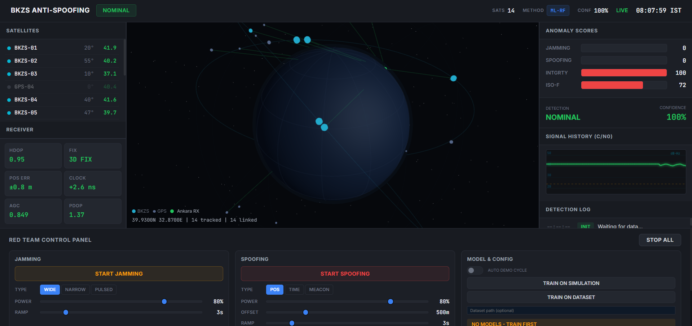

# BKZS Sinyal Doğrulama ve Sahteciliğe Karşı Koruma Sistemi

BKZS (Bölgesel Konumlama ve Zamanlama Sistemi) için gerçek zamanlı GNSS sinyal doğrulama ve sahteciliğe karşı koruma prototipi.

**TUA Astro Hackathon 2026**

## Özellikler

- **GNSS Sinyal Simülatörü** — Gerçekçi CN0, Doppler, AGC, saat kayması değerleriyle 24 uydulu konstellasyon (6 BKZS + 18 GPS)
- **Saldırı Enjeksiyon Motoru** — Yumuşak yoğunluk artışıyla bozma (geniş bant/dar bant/darbeli) ve sahteciliği (konum itme/zaman itme/meaconing) saldırıları
- **3 Katmanlı Makine Öğrenmesi Tespiti** — Kural tabanlı + Rastgele Orman (denetimli) + İzolasyon Ormanı (denetimsiz anomali)
- **Gerçek Zamanlı Gösterge Paneli** — Uydu takibi, bağlantı hatları, sinyal grafikleri ve anomali skorlarıyla etkileşimli 3D küre
- **Kırmızı Takım Kontrol Paneli** — Arayüzden doğrudan yapılandırılabilir parametrelerle saldırı başlatma/durdurma
- **WebSocket Akışı** — Gerçek zamanlı görselleştirme için 2Hz'de canlı veri




## Hızlı Başlangıç

### 1. Kurulum

```bash
cd bkzs-antispoofing
python -m venv venv
source venv/bin/activate  # Linux/Mac
# VEYA: venv\Scripts\activate  # Windows
pip install -r requirements.txt
```

### 2. Veri Kümesini İndir (İsteğe Bağlı)

Mendeley GNSS Veri Kümesini (Bölüm III) indirin ve `data/raw/` dizinine çıkartın:

**Veri Kümesi:** [Parazit ve Sahteciliği İçeren GNSS Veri Kümesi — Bölüm III](https://data.mendeley.com/datasets/nxk9r22wd6/3)

```
data/
  raw/
    GNSS Dataset (with Interference and Spoofing) Part III/
      1221/           # Saldırı verisi
      Processed data/ # Temiz veri (21-30 arası klasörler)
```

> Bu adımı atlarsanız yine de simüle edilmiş veri üzerinde eğitim yapabilirsiniz — indirme gerekmez.

### 3. Modelleri Eğit

```bash
# Simüle edilmiş veriyle (hemen çalışır):
python scripts/train.py

# Mendeley veri kümesiyle:
python scripts/train.py --dataset mendeley --data-path data/raw/
```

Eğitimi arayüzdeki Model ve Yapılandırma bölümünden de başlatabilirsiniz.

### 4. Çalıştır

```bash
python -m backend.main
```

Açın: **http://localhost:8000**

## Gösterge Paneli

| Bölüm | Açıklama |
|-------|----------|
| **Sol Panel** | Uydu başına CN0 ve yükselim açısıyla canlı uydu listesi |
| **Merkez** | Etkileşimli 3D küre — uydular yörüngede döner, bağlantı hatları sinyal kalitesini gösterir |
| **Sağ Panel** | Anomali skorları (bozma/sahteciliği/bütünlük/izolasyon ormanı), sinyal geçmişi grafiği, tespit günlüğü |
| **Alt** | Kırmızı Takım saldırı kontrolleri, model eğitimi, eşik ayarı, uyarı akışı |

### Saldırı Enjeksiyonu

Kırmızı Takım Kontrol Panelinden:

- **Bozma:** Tür seçin (Geniş Bant/Dar Bant/Darbeli), güç ve artış süresini ayarlayın
- **Sahteciliği:** Tür seçin (Konum İtme/Zaman İtme/Meaconing), mesafe sapması ve artış süresini ayarlayın
- **Otomatik Demo:** Otomatik saldırı döngüsü için etkinleştirin (20s nominal → 8s bozma → 12s nominal → 8s sahteciliği)

### REST API

```
GET  /api/status         Sistem sağlığı ve model durumu
GET  /api/snapshot       Tespitli tek GNSS anlık görüntüsü
POST /api/attack/start   Saldırı enjeksiyonunu başlat
POST /api/attack/stop    Tüm saldırıları durdur
POST /api/train          ML modellerini eğit (arka planda)
GET  /api/train/status   Eğitim ilerlemesi ve sonuçları
POST /api/thresholds     Tespit eşiklerini güncelle
WS   /ws                 2Hz'de canlı GNSS akışı
```

## Mimari

```
GNSSSimülatör ──► SaldırıMotoru (yoğunluk artışı)
       │
  GNSSAnlıkGörüntü (10 boyutlu özellik vektörü)
       │
  AnomaliBelirleyici:
    Katman 1: Kural tabanlı    (anlık, açıklanabilir)
    Katman 2: Rastgele Orman   (denetimli, 3 sınıf: NOMİNAL/BOZMA/SAHTECİLİK)
    Katman 3: İzolasyon Ormanı (denetimsiz, yeni saldırıları yakalar)
       │
  Karar Birleştirme ──► WebSocket yayını ──► Gösterge Paneli Arayüzü
```

### Özellik Vektörü

| Özellik | Açıklama |
|---------|----------|
| avg_cn0 | Görünür uydular genelinde ortalama C/N0 |
| min_cn0 | Minimum C/N0 |
| std_cn0 | C/N0 standart sapması |
| cn0_delta | C/N0 değişim hızı |
| visible_count | Görünür uydu sayısı |
| hdop | Yatay hassasiyet düşümü |
| pos_delta_m | Metre cinsinden konum sıçraması |
| clock_offset_delta_ns | Saat kayması değişim hızı |
| doppler_residual | Doppler tutarlılık metriği |
| agc_level | Otomatik kazanç kontrolü seviyesi |

## Proje Yapısı

```
bkzs-antispoofing/
├── backend/
│   ├── main.py              # FastAPI giriş noktası
│   ├── config.py            # Ayarlar ve eşikler
│   ├── gnss/
│   │   ├── simulator.py     # GNSS sinyal simülatörü
│   │   └── attack_engine.py # Artışlı saldırı enjeksiyonu
│   ├── ml/
│   │   ├── detector.py      # 3 katmanlı anomali tespiti
│   │   ├── trainer.py       # Model eğitim hattı
│   │   └── dataset_loader.py # Mendeley + sentetik veri
│   └── api/
│       ├── routes.py        # REST uç noktaları
│       └── websocket.py     # WebSocket akışı
├── frontend/
│   ├── index.html           # Gösterge paneli düzeni
│   ├── css/dashboard.css    # Stil
│   └── js/
│       ├── dashboard.js     # Ana denetleyici
│       └── globe.js         # 3D küre (Three.js)
├── scripts/
│   ├── train.py             # CLI eğitim betiği
│   └── prepare_dataset.py   # Veri kümesi hazırlama
├── tests/                   # Birim testleri
├── data/                    # Veri kümesi dizini (ayrıca indirilir)
├── models/                  # Eğitilmiş model dosyaları
└── requirements.txt
```

## Veri Kümesi

**Kaynak:** [Yunnan Üniversitesi — Parazit ve Sahteciliği İçeren GNSS Veri Kümesi (Bölüm III)](https://data.mendeley.com/datasets/nxk9r22wd6/3)

Bu veri kümesi, parazit ve sahteciliği senaryolarıyla gerçek GNSS gözlemlerini içermektedir. Çıkartılan veriyi `data/raw/` dizinine yerleştirin. Sistem, veri kümesi mevcut değilse tamamen sentetik veri üzerinde eğitimi de destekler.

## Lisans

MIT